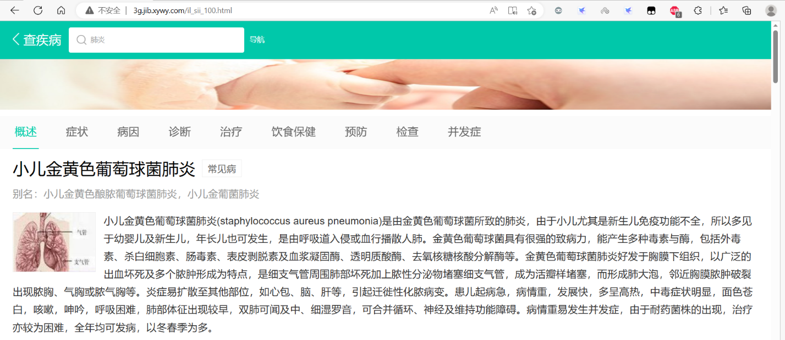
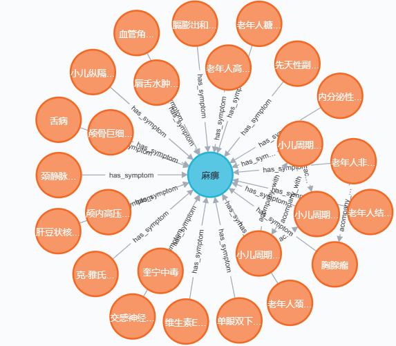
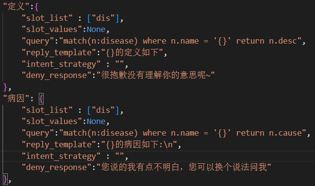

## 环境配置
pytorch版本2.0.0+cu117  
Flask==2.2.3  
Flask-Cors==3.0.10  
gevent==22.10.2  
numpy==1.24.2  
pandas==2.0.0  
py2neo==2021.2.3  
pyahocorasick==2.0.0  
requests==2.28.2  
scikit-learn==1.2.2  
transformers==4.28.1  
请自行安装pytorch
## 运行步骤  
首先运行data_spider中的buildKG文件，创建一个neo4j存储的知识图谱  
然后依次运行NER中的app.py文件，intent_recognition中的app.py文件  
最后运行本层目录下的app.py文件  
请注意要cd到对应目录下运行  
如此后端就启动完成了  
在上面的所有步骤中要开启neo4j的连接  
## 搭建步骤
### 构建知识图谱
选择自顶向下的方式构建知识图谱，首先从[相关网站](http://3g.jib.xywy.com/)爬取结构化数据，借助爬取的结构化数据来构建医疗知识图谱。使用 Neo4j 图数据库来存储知识图谱，知识图谱的实体和实体间的关系可以很好映射为 Neo4j 中的节点和边。  
需要的数据包括该网站所收录的疾病的一些基本常识、疾病的症状、疾病所需检查、疾病推荐药品、疾病推荐和不能吃的食物、疾病并发症等数据

最后构建的知识图谱如下图所示

### 命名实体识别
本文采用基于规则的方法识别医疗实体，本文采用的方法是字符串匹配算法Aho-Corasick。

### 问题分类
采用开源数据集和阿里天池比赛的数据集KUAKE-QIC，共12868条训练数据，共有16类问题。如下表所示。  
|类别    |问句     |  
|------  |----------|
|疾病定义|肺纤维化是什么病?|
|疾病病因|脑膜脑炎是如何引起的?|
|疾病预防|	咋样绕开肺地丝菌病|
|疾病症状|	老年人心肌梗死的症状有哪些特点？|
|疾病并发症|	结节性液化性脂膜炎有什么一并出现|
|疾病治疗方法|	痤疮的治疗方法|
|疾病所属科室|	肾盏憩室看啥科呢|
|疾病是否有传染性|	请问得了松毛虫性骨关节病会传给孕妇吗|
|疾病治愈率|	变异性哮喘可以治愈吗|
|疾病禁忌|	感冒不能吃什么食物|
|疾病所需检查|	妇产科静脉血栓病做啥检查|
|疾病治疗时间|	老年人急性淋巴细胞白血病治好得多少年|
|疾病医疗费用|	治疗宫颈粘连的费用多少钱|
|药品的功效作用|	盐酸左氧氟沙星滴耳液的作用|
|病情诊断|	男性小腹疼痛是什么原因？|
|其他|	172的身高还能长高吗？|  
-----------------
用BERT+TextCNN来对问句进行分类，需要先下载哈工大预训练的rbt3模型，用于以后的工作。
### 答案查询
为每类问题设定了对应的查询语句，大致如图4-14所示。一类问题对应了一类查询语句。

系统首先识别出问题中的医疗实体和对问题进行分类，然后根据类别选择查询语句，如果识别的医疗实体类别和slot_list的实体类别相同，那么就可以用识别出的医疗实体填充query中的{}，填充之后就得到完整的查询语句，就可以从知识库即Neo4j图数据库中查询出答案。
