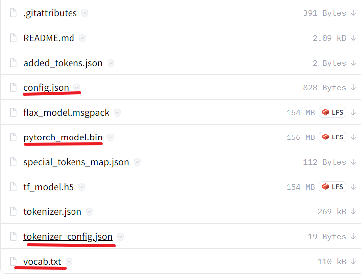

首先去[huggingface官网](https://huggingface.co/hfl/rbt3/tree/main)下载所需模型  
需要的文件如图中画横线的
    
要保存rbt文件夹中  
我训练的模型放到[百度网盘](链接：https://pan.baidu.com/s/1RjGb2e8FBN1n2pe77gn33Q?pwd=vgyu 
)提取码：vgyu  
下载之后放到checkpoint文件夹，就可以运行app.py